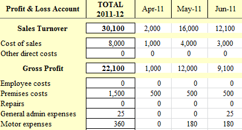

# name
BasicSoleTraderProduct

# title
Sole Trader Simple Bookkeeping, Tax and Basic Accounts Spreadsheet

# shortTitle
Basic Sole Trader

# from
20

# description
Simplest personal accounting software package consisting of a sales accounting spreadsheet, purchases accounting spreadsheet and a financial accounts file. <u><a href="product.html?product=BasicSoleTraderProduct">Small business accounting</a></u> software UK package <u><a href="product.html?product=BasicSoleTraderProduct">suitable for sole traders</a></u> that are <strong>not vat registered</strong>, will not be vat registered in the future and do not have employees. A simple book keeping system with fast entry of financial information into the accounts package with <a href="feature.html?feature=ProfitAndLossFeature">profit &amp; loss account</a> automated and the <strong>Self employed short tax return</strong> suitable for businesses that will not become vat registered during the financial year replacing the work a tax accountant might perform. Basic accounting software that is the easy accountancy software of choice being the simplest small business accounts software where bank financial accounting software spreadsheets and the payroll solution are not required.

# image

# trailingBody

    <strong>Suitability of the Sole Trader Accounts Package</strong>

    The easy accounting package consists of two excel accounts spreadsheets, <a href="feature.html?feature=SalesSpreadsheetFeature">sales accounts spreadsheets</a> and expense <a href="feature.html?feature=SalesSpreadsheetFeature">accounts spreadsheets</a> for purchases with a <a href="feature.html?feature=ProfitAndLossFeature">financial accounting</a> file that collects the bookkeeping entries and produces the year end <a href="feature.html?feature=ProfitAndLossFeature">Sole trader financial profit and loss accounts statement and assets</a><a href="feature.html?feature=ProfitAndLossFeature">income and expenditure accoun</a><a href="feature.html?feature=ProfitAndLossFeature">t</a> including the <a href="feature.html?feature=SelfEmployedTaxFeature">tax liability</a> and an automated excel copy of the self employed tax return form. No bookkeeping or accounting knowledge is required as the self employed bookkeeping system works on single accounting entries using very basic spreadsheets no more complicated than making lists..

    <strong>Value Added Tax</strong>

    The easy accounting basic spreadsheets in the sole trader accounts software package does not have columns to separately record vat inputs and outputs and is therefore not suitable as a vat registered self employed bookkeeping system or likely to be vat registered during the financial year. If vat registration is a possibility then the self employed accounts software package would be more suitable as flexible to deal with both vat and <a href="feature.html?feature=VatReturnsFeature">non vat registered business</a>. The vat threshold from 6th April 2008 is &pound;67,000.
     
     
     
    <strong>Short Self employed Tax Return</strong>

    In April 2008 HMRC introduced two versions of the new self employed tax return to replace the self assessment tax return with effect from the financial year 2007-08 The <a href="feature.html?feature=SelfAssessmentFeature">short tax return</a> is completed by businesses with a sales turnover of under &pound;64,000 p.a. with the full tax return including further expense analysis being required from businesses that exceed the &pound;64,000 threshold.
     
    The sole trader tax accounting package produces an excel copy of the short self employed tax return and therefore the self employed accounts package would be more appropriate if sales turnover might exceed &pound;64,000 as the self employed small business tax software produces both short and full versions of the tax return.

    
     
     
     
    <strong>Business Bank Account</strong>

    Self employed accounts do not have to have a business bank account although the majority do. If the business is operating a business bank account then the accounting records should include the entries to that account. The sole trader accounts package does not include a bank account spreadsheet and so if one is operated then the self employed accounting package would be more suitable as that accounts package includes business bank accounting spreadsheets
     
     
     
    <strong>Employees</strong>

    The sole trader accounts package does not include a wages interface and does not have the facility to be used with the integrated payroll software. The self employed accounting package has these additional facilities which would be a better choice if employees are likely to be employed during the financial year.
     
     
     
    <strong>Suitability Summary:</strong>

    If the sole trader does not operate a business bank account, has no employees and will not exceed the vat threshold then the sole trader accounts package is the basic accounting choice.
     
    Alternatively choose the self employed accounting package for your small business accounting software

# metaDescription
Simple bookkeeping system for a sole trader providing basic accounts spreadsheets with automated tax accounting software and self employed tax return

# keywords
accounting package,accounting spreadsheets,accounting spreadsheet,accounts software,basic accounting,basic accounting software,bookkeeping system,self employed,self employed accounts,self employed bookkeeping,self employed tax return,simple bookkeeping,small business accounting,small business accounts software,small business tax software,sole trader,tax return,sole trader accounts,self employed tax,basic accounts,basic spreadsheet,simple accounts,simple accounting,accounts spreadsheets

# featureNames
- ProfitAndLossFeature
- SalesSpreadsheetFeature
- PurchaseSpreadsheetFeature
- SelfAssessmentFeature
- SelfEmployedTaxFeature

# featured
true

# precedence
010
