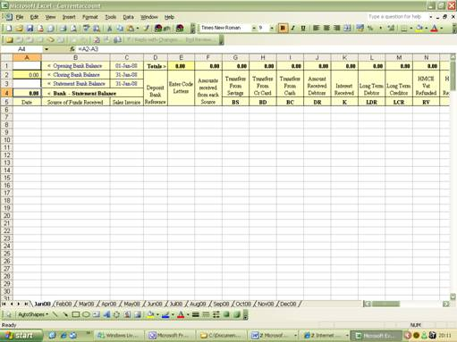
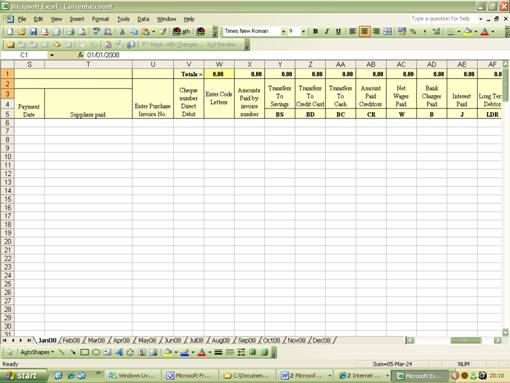

# name
CashandBankFeature

# title
Company accounts package cash and bank spreadsheets

# shortTitle
Cash & Bank

# description

        DIY Accounting Software includes 4 spreadsheets for cash and bank transactions being one each for Cash, Bank, Savings and Credit Card &nbsp;each with a self balancing Bank Reconciliation to enable the accuracy of the financial transactions names, income tax and national insurance calculated automatically.
    

# trailingBody

    <strong>DIY Accounting Cash &amp; Bank Excel Spreadsheet</strong>

    <strong>Limited Company small business book keeping software UK</strong>

Sales and expenses are recorded on the Sales and Purchases workbooks not the Cash and Bank records. Entries to the Sales and Purchases workbooks create accounts of money owing to or by the business regardless of whether these accounts are paid or received instantly. These liabilities are called Debtors (sales not received) and Creditors (purchases not paid).

Entries to the Cash and Bank records are not used to record sales or expenses, with the exception of purely bank generated income and expenses such as bank interest received, bank interest paid and bank charges. Cash and Bank records are used to record the receipts from Debtors and payments to Creditors.

    <em><strong>Balance Sheets are an essential legal requirement for every Limited Liability Company.</strong></em>

DIY Accounting Software includes 4 spreadsheets for cash and bank transactions being one each for Cash, Bank, Savings and Credit Card each with a self balancing Bank Reconciliation to enable the accuracy of the financial transactions

    <strong>BANK RECEIPTS</strong>

Entry to the cash and Bank receipts side of the cash and bank spreadsheets are similar format to the sales and purchase spreadsheets. Essential to produce an annual Balance Sheet

    

    <strong>BANK PAYMENTS</strong>

Analysis of the bank statement provides financial control and allows banking expense entries and drawings to be entered which are then automated and included in the monthly profit and loss account. Drawings by Directors are collected by the Accounting Software and transferred automatically to the Directors Loan Account.

    

    <strong>CASH BOOK</strong>

A Cash book spreadsheet is also provided which again is optional and in the same format as the Bank spreadsheet

The excel book keeping spreadsheets were designed from the simple small business bookkeeping software used for existing clients to make financial transactions fast, easy to enter and understand. Formula driven so that minimum data is entered with automated analysis producing from the book keeping system. Accountancy software reduced to its simplest form of single entry.

    <strong>BANK RECONCILIATION</strong>

Automated from the entries made to the bank account simply enter the statement balance each month and the Bank spreadsheet does the bank reconciliation automatically to ensure the total of any missed items are highlighted

    <strong>Image here&nbsp;</strong>

    <strong>What happens to the Cash and Bank bookkeeping information entered?</strong>

The above excel book keeping spreadsheet totals each column for each book keeping month. The totals of each sheet are then collected by the accountancy software to complete the simple book keeping system by automatically producing the monthly profit and loss account and Published Financial Accounts to complete the limited company book keeping system.

The user guide that accompanies this self employed book keeping system has notes on cash and bank spreadsheets to assist a comprehensive Accounting Software package to be completed with ease and maintain full financial control.

Accountancy software designed to save many times the cost of buying it.

    <em>DIY Accounting "Small business book keeping software, simple self employed book keeping system on excel spreadsheets"</em>

    <em><strong>
             
        </strong></em>

    <strong>
         
    </strong>

# metaDescription

        DIY Accounting Software includes 4 spreadsheets for cash and bank transactions being one each for Cash, Bank, Savings and Credit Card &nbsp;each with a self balancing Bank Reconciliation to enable the accuracy of the financial transactions names, income tax and national insurance calculated automatically.
    

# keywords

        DIY Accounting Software includes 4 spreadsheets for cash and bank transactions being one each for Cash, Bank, Savings and Credit Card &nbsp;each with a self balancing Bank Reconciliation to enable the accuracy of the financial transactions names, income tax and national insurance calculated automatically.
    

