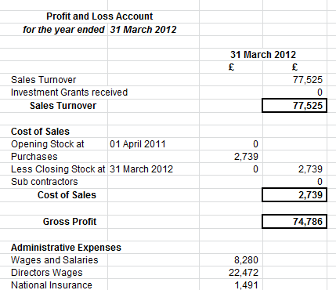

# name
CompanyAccountsProduct

# title
Abbreviated limited company account financial accounts software

# shortTitle
Company Accounts

# from
45

# description
Small business accounting software UK package suitable for a limited liability company that can be <a href="feature.html?feature=VatReturnsFeature">vat registered</a> or not registered and also who may have employees. All limited company has at least one employee being the director. The company accounts software is based upon double entry bookkeeping principles and fully integrated with the Payroll software for up to 5 , 10 or 20 employees simply by saving the accountancy software files into the same folder as the payroll software files. The company accounts software produces quarterly <a href="feature.html?feature=VatReturnsFeature">vat returns</a> for vet registered companies,<a href="feature.html?feature=CompanyProfitandLossFeature"> profit &amp; loss accounts</a>, balance sheet and all the documents to submit a set of final year end accounts to Companies House including notes to the accounts software providing a simple yet complete package for a limited company. Financial accounting software packages are available for each financial accounts tax year end from 2007 to 2015, 2016, 2017, 2018, 2019, &nbsp; Limited company UK Accounting Software packages incorporate tax return software to complete the corporation tax calculation and fill in the CT600 company short tax return providing the ultimate solution in <a href="feature.html?feature=TaxandAssetsFeature">small business tax software</a>.

# image

# trailingBody

DIY Accounting Company Accounts Software for any small to medium Limited Liability Company is designed using accounting spreadsheets templates so all entries can be instantly viewed and suitable for vat registered, not vat registered, with or without employees.

    From April 2019 the next phase of the HMRC <strong>Making Tax Digital</strong> comes into force. We are&nbsp;pleased to announce a collaboration with VitalTax to ensure our customers will be able to comply.&nbsp;Checkout our <a href="feature.html?feature=VatReturnsFeature">VAT page</a> for more information.

    The formulae encoded within the financial accounts software automates all the accountancy entries, produces Corporation Tax calculations and a full set of year end abbreviated Company Accounts ready for submission to Companies House and HM revenue &amp; Customs including automatically generating an excel spreadsheet copy of the <a href="feature.html?feature=TaxandAssetsFeature">CT600 Corporation Tax Return</a> and the audit exemption statements.

    Comprehensive business accounts software for small to medium limited liability companies that records your company financial accounts, DIY Accounting provides simple business accounting software that automatically updates your financial accounts including all double entry bookkeeping and provides financial control through both <a href="feature.html?feature=CompanyPurchaseSpreadsheetFeature">creditor</a> and <a href="feature.html?feature=CompanySalesSpreadsheetFeature">debtor</a> control and with an automated accounting analysis of your expenditure. The company accounts software automatically produces <a href="feature.html?feature=VatReturnsFeature">quarterly vat returns</a>, monthly profit &amp; loss account and an accounting spreadsheet containing the year end financial accounts by automating the <a href="feature.html?feature=CompanyProfitandLossFeature">Profit and Loss Account</a> and <a href="feature.html?feature=YearEndAccountsFeature">Balance Sheet</a> in the format required for publication to Companies House and HMRC The year end accounts contain the audit exemption statements required for submission to satisfy the Companies Acts of 1985 and 2006 as appropriate. All accounting entries to produce the small limited abbreviated company accounts balance sheet, profit &amp; loss account for existing small companies and new start up business from simple lists of sales, and purchases and cash &amp; bank transactions.

    Simple, yet sophisticated accounting software, DIY Accounting software is specific to the financial year end chosen with updated tax allowances, calculates the Corporation tax liability, provides <a href="feature.html?feature=CompanyProfitandLossFeature">Stock Control</a> and includes a wages interface that is fully integrated with the DIY Accounting Payroll Software simply by saving the Payroll files to the same folder as the DIY Accounting Software for Limited Companies. Accounting Software that both reduces the small business accounting costs to the absolute minimum saving substantial accountant fees on the year end financial accounts as the Accountants work has all been automated including producing a set of abbreviated accounts ready for publication including the audit exemption and other statutory balance sheet statements that must accompany the year end accounts This accounts software package is designed to suit any small to medium Limited Liability Company who are vat or not vat registered, and lets small and medium business manage their financial accounts, customers and suppliers without previous accounts software experience.

    <strong>Payroll Integration</strong>

DIY Accounting Limited Company accounts software has a number of features to provide a complete financial accounts software package. Each financial accounting package contains a wages interface enabling the DIY Accounting One Click Payroll to be integrated within the system simply by downloading the DIY Accounting Payroll package to the same folder as the Accounting Software.

Clients who are not using DIY Accounting Payroll systems manually enter wages totals into the Wages Interface to update the financial accounts. Companies with no employees simply leave the Wages Interface blank although officially all directors of a limited company are in fact categorised as employees of that company.

    <strong>Corporation Tax Calculation and CT600 Tax Return</strong>

    Small business tax software that calculates the corporation tax and completes an excel copy of the <a href="feature.html?feature=TaxandAssetsFeature">CT600 tax return</a>

    <a href="feature.html?feature=TaxandAssetsFeature">Corporation Tax calculation</a> spreadsheet automatically completed with no manual entries required. Dates and tax rates have all been entered in the structure of the financial accounts package according to the company accounts financial year end and the tax rates applicable to that financial year.

    The DIY Accounting software package for limited companies produces an excel copy of the CT600 short tax return. All entries being automated collected from the tax calculation and general company details. The format of this excel copy has been designed to look and feel exactly the same as the official HM Revenue &amp; Customs form to enable it to be printed and the numbers all being calculated accurately in the correct boxes to enable them to be copied straight into the official <a href="feature.html?feature=TaxandAssetsFeature">CT600 short tax return</a>.

    <strong>Suitable for both VAT and Non VAT registered business&nbsp;</strong>

    DIY Accounting Limited Company Accounts Software can be used by both vat registered and non vat registered business or convert the accounts from one to the other as easily as changing the vat rate from&nbsp;standard rate (20% in 2013)&nbsp;to zero in one Cell which disables the vat calculation. register for vat during the financial year and simply change that cell from zero to standard rate (20% in 2013)&nbsp;in the month registered and vat will be collected and calculated from that month onwards. The company financial accounts software user guide also advises how the <a href="feature.html?feature=VatReturnsFeature">Flat Rate Vat scheme </a>can be easily included in the vat calculation. Flexible Accounting Software

    DIY Accounting Software provides a complete solution and includes <a href="feature.html?feature=CashandBankFeature">Cash and Bank</a> Spreadsheets fully linked to the financial accounts to automatically include in the company accounts bank charges and interest received.

    DIY Accounting Software also includes a <a href="feature.html?feature=CompanySalesSpreadsheetFeature">Sales Invoice generator </a>to enable users to quickly and professionally produce Sales Invoices with minimum fuss and repetition and a <a href="feature.html?feature=CompanyPurchaseSpreadsheetFeature">Stock Control </a>overview that calculates expected stock levels for comparison with actual stock values.

    <strong>DIY Accounting Software</strong> for small to medium business, gives you an immediate snapshot of your financial position, with columns showing you which suppliers need paying and who owes you money. Vat returns are produced automatically by the accounts software and available to be viewed at any time during the vat quarter. An accounts software package that also produces a monthly P&amp;L account plus an excel copy of your Published Financial Accounts ready for submission to Companies House

    <strong>DIY Accounting Limited Company Financial Accounts</strong> have been designed on Microsoft Excel worksheets. Excel must be installed on your computer to enable this company accounts software to work although the financial accounts software also works with the Open source spreadsheet program.

    <strong>Choose DIY Accounting Limited Company</strong> if you operate a small <strong>Limited Company</strong> defined as turnover under &pound;2.8million and less than 20 employees even if not experienced with Accounting Software and want a simple company accounts software package designed specifically for the UK as a small to medium business accounting software package that automates your Vat Returns abbreviated accounts for Companies House and Inland Revenue including Corporation Tax Return.

Declaring a dividend and accounting for the dividend tax credit are common issues considered by directors to minimise the tax liability.

Click here to visit the DIY Accounting Company Accounts Software Order page

Key Features &amp; Benefits of DIY Limited Company Accounts Software UK

<ul>
    <li>Enter purchase invoices from suppliers, the money control feature shows who has been paid and is outstanding.</li>
    <li>Enter sales invoices to customers and the money control feature shows who has paid and who still owes you money.</li>
    <li>Single letter entry on the purchases spreadsheet provides the accounting expenditure analysis and updates your financial accounts.</li>
    <li>Enter vehicles and assets purchased and the Fixed Asset schedule calculates the capital allowances and puts these in your self assessment tax return for you</li>
    <li>Quarterly Vat returns produced with details how to protect your sheets providing a vat audit trail</li>
    <li>DIY Accounting Payroll Software easily integrated to provide the Complete Accounting Software solution</li>
    <li>Cash and Bank spreadsheets for those businesses who operate business bank accounts with automated bank reconciliations</li>
    <li>Stock Control feature to identify and control potential losses</li>
    <li>Annual and Monthly Profit and Loss Accounts produced.</li>
    <li>Fully automated Small Business Tax Software that calculates annual corporation tax and produces an automated excel copy of the CT600 short tax return</li>
    <li>Accounting software that produces a copy of the audit exemption year end financial accounts ready for submission to Companies House, no entries required</li>
    <li>DIY Accounting software that calculates your Corporation Tax and Capital Tax Allowances</li>
    <li>DIY Accounting Limited Company Accounts simple business accounting software UK User Guide accompanies the package containing concise, easy to read notes plus all important tips on HM Revenue &amp; Customs guidelines to save you taxes.</li>
    <li>Technical and Operational support completing the Accounting Spreadsheets direct from the designer is included by phone or online via email with over 95% of questions dealt with the same day.</li>
</ul>

    If you wish to ask a question please post your question in the DIY Facebook page at&nbsp;<a href="https://www.facebook.com/DIY.Accounting.Software/">https://www.facebook.com/DIY.Accounting.Software/</a>

# metaDescription
DIY Accounting abbreviated limited company accounts software produces vat returns, corporation tax, CT600 tax form and year end financial accounts.

# keywords
accounting software, payroll software, accounting spreadsheets, small business software, tax software, accounting software package, small business accounting software, small business accounting, self employed tax return, bookkeeping, accounting software uk, payroll, company formation, company formation UK, tax, tax return, tax accounting, accounting, limited liability company

# featureNames
- CompanySalesSpreadsheetFeature
- CompanyPurchaseSpreadsheetFeature
- CashandBankFeature
- TaxandAssetsFeature
- VatReturnsFeature
- CompanyFinalAccountsFeature
- YearEndAccountsFeature
- CompanyProfitandLossFeature
- SalesInvoiceFeature
- PayslipsFeature

# featured
true

# precedence
020
