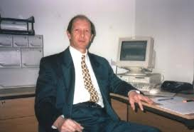

# name
HistoryPage

# title
History of DIY Accounting - Accounting and Payroll Software

# description
Since Terry's passing in December 2009, it has by been his children; Antony, Jane, Samantha, Lindsey and
Daniel taking control of the company. With some outside help we have aimed to provide the high quality of care and
expertise that Terry provided alone. We hope to meet your expectations but our success is based on your custom.. So let
us know what you think...

# image

# trailingBody

<strong>Our Founder's Career History:</strong> 

Having qualified as a Chartered Management
Accountant (ACMA) in 1971, my first assignment as a management accountant being to design the revenue budgeting system
for British Rail, following which I spent two years with New World Gas Cookers initially as Management Accountant, then
Works Accountant, where I also gained my second professional qualification as a Chartered Company Secretary (ACIS).
Following two years and several promotions within British Steel's Audit Division I was appointed Head of Finance and
Administration for the Refractories division. Left to work in Saudi Arabia as a Chief Accountant for an American
corporation and on return to the UK was appointed Chief Accountant at Dunlop Industrial Hose division.

In the early 1980's I allowed my membership of the professional bodies CIMA and CISA to lapse when I left the accounting
profession and started my own retail and wholesale company buying the first shop with &pound;10k p.a. turnover, within a
few years the business had half a dozen outlets, employees into double figures and sales heading towards that magic
&pound;1 million pound mark.

	It wasn't particularly profitable at times and in the early 90's I came back to
accountancy taking numerous assignments across a whole range of finance projects including designing a European sales
accounting system for an international corporation, installing Oracle accounting software modules and a couple of years
developing a treasury management system for a major UK bank.

Following a four year spell as Finance director for
a communications company I semi-retired in 2000 earning a part-time income from my long term hobby, ornithology,
supplementing my income from several industrial companies preparing their annual financial accounts.

2006 has
marked yet another career change, DIY Accounting, designing payroll and accounting systems on excel spreadsheets and in
my capacity of a chartered company secretary also as a company formation agent..

DIY Accounting software, payroll
software have all been designed by myself. Should you have a question relating to either the accounting software, book
keeping or the payroll software then it will be myself who will personally answer your questions.

As a company formation agent, using my experience as a Chartered company secretary deal directly with clients regarding company
formation including writing the company formation memorandum and providing guidance throughout the company formation
sequence.

All accounting software and payroll software are single user programs to which customers buy a licence
to use. The copyright is owned by Terry Cartwright who authorises users to use and copy the software for their own
business use while specifically excluding the right to resell or share the software packages with any other business for
any other reason. Resellers are invited to request a licence to resell the products.

# metaDescription
Terry Cartwright, diy accounting

# keywords
accounting software, payroll software, accounting spreadsheets, small business software, tax software,
accounting software package, small business accounting software, small business accounting, self employed tax return,
bookkeeping, accounting software uk, payroll, company formation, company formation UK, tax, tax return, tax accounting,
accounting, limited liability company
