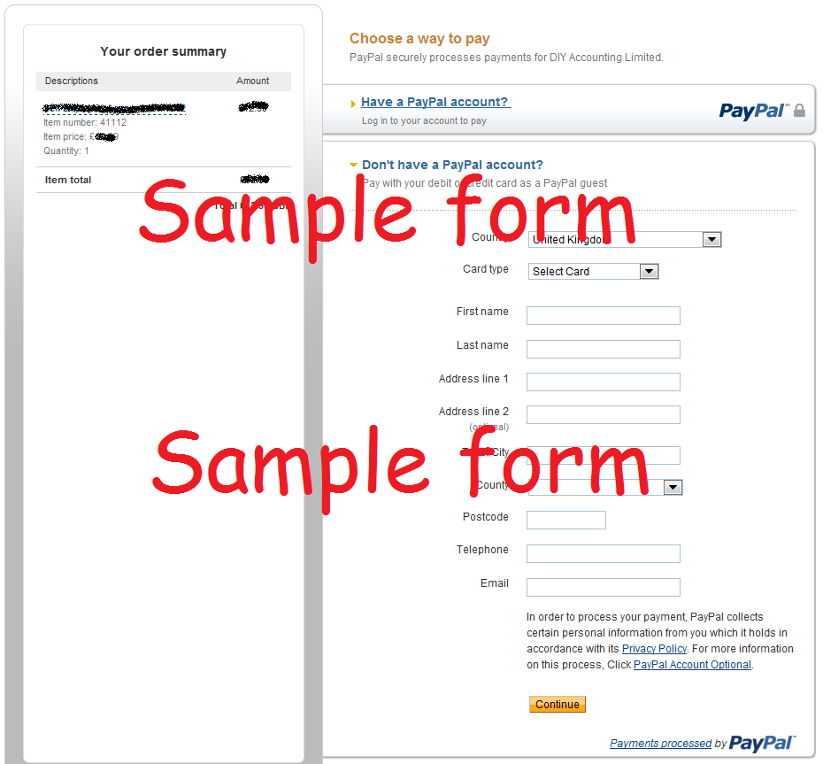

# name
PayingWithoutAPayPalAccountArticle

# title
Help on: paying without a PayPal account

# shortTitle
Help on: paying without a PayPal account

# description
You can pay using your credit card but without using a PayPal Account. PayPal still process the transactions and we'll need your email but no PayPal account is required.

# trailingBody

Buying software through DIY Accounting does not require a PayPal account. Once you click Checkout, look for the "Don't have a PayPal Account?" link:

    

After clicking on "Don't have a PayPal account?" you'll be presented with a form to enter your credit card details directly. PayPal still process the transaction as a "Payment Gateway" and they credit funds to our account. You'll need to me sure you enter an accurate email address as PayPal share this information with us so we can&nbsp;fulfil your order.

    

Sometimes credit card payments are rejected either at PayPal's choice or by the card issuer. This isn't something we can help with as your credit card details are not shared with us. The first and best contact would be your card issuer.

If you think you have been charged and were not taken to your download page, please forward your PayPal receipt so we can track your order.

# metaDescription
How to make a payment without a PayPal account

# keywords
PayPal payment account credit card

# featured
false

# whatsnew
false
