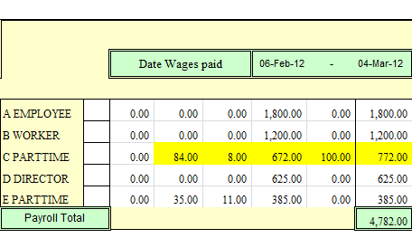
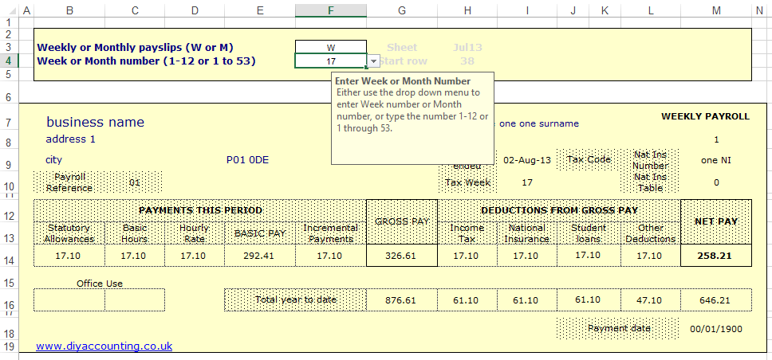

# name
PayslipProduct

# title
Payslip Generator

# shortTitle
Payslip

# from
2

# description

        The DIY Accounting payslip generator is designed for customers who would like a payslip generation facility but use a separate tax calculator such as <a href="http://www.hmrc.gov.uk/payerti/payroll/bpt/index.htm">HMRC&rsquo;s Basic PAYE Tools</a>. For customers with a DIY Accounting business accounts system such as <a href="product.html?product=CompanyAccountsProduct">Company Accounts</a> or <a href="product.html?product=SelfEmployedProduct">Self Employed</a>, the payslip generator feed through into the business accounts via the Wages Interface sheet. A Payment sheet is included to track payments to HMRC.
    

    

        Excel or an open source spreadsheet program must be installed on your computer since the package consists of payroll spreadsheets.
    

# image

# trailingBody

    <strong>Simple spreadsheet entry</strong>

The payslip generator is spreadsheet based so you can rely on the usability of products such as Microsoft Excel (or OpenOffice) to enter payroll information on a weekly or monthly basis. There is a entry for each of employee for each payroll week and month. A running total of wages and tax paid through out the year is maintained for your reference.

    <strong>Payslip Generation</strong>

    The payslip generator uses a single form to generate payslips for a given week or month in a similar way to our&nbsp;<a href="feature.html?feature=SalesInvoiceFeature">Sales Invoice</a> that is included with the&nbsp;<a href="product.html?product=CompanyAccountsProduct">Company Accounts</a> and&nbsp;<a href="product.html?product=SelfEmployedProduct">Self Employed</a> products.

    

    <strong>Payslips Automated and Printed on Plain Paper</strong>

The UK payroll package automatically produces monthly or weekly payslips for each employee. No entries required, the payslips are produced automatically. The payroll produces these payslips which can be printed out on ordinary copy paper. No special payroll or payslip stationery is required. The entire payroll software system costing less than many companies charge just for payslip stationery alone.

    <strong>UK Payslip System User Guide</strong>

The payslip system user guide provides easy step by step instructions which are not complicated technical specifications but easy to read notes written in layman's language.

    <strong style="font-size: 10.0pt;line-height: 13.0pt;">DIY Accounting Payslip Software - Key Features &amp; Benefits</strong>

<ul>
    <li>This payslip solution is fast and easy to use requiring employee details to be entered once per year, leaving just the important figures to be entered for the payslips.</li>
    <li>Salary Payslips automatically generated and available in real time with wage slips being printed on plain paper with no requirement for expensive specialised documentation.</li>
    <li>Payslip User Guide accompanies the package containing concise, easy to read notes to lead you through the package which has been made as fast and easy as possible</li>
    <li>DIY Accounting payroll software is supplied as standard with the advanced accounting product.&nbsp; Please visit advanced accounting if you also wish to have the payroll software integrated into a spreadsheet accounting software</li>
    <li>Technical and Operational support is included by phone or online via email with over 95% of questions dealt with the same day.</li>
</ul>

     
    If you wish to ask a question please post your question in the DIY Accounting Teneric forum at&nbsp;<a href="http://forums.teneric.co.uk/diy-accounting/">http://forums.teneric.co.uk/diy-accounting/</a>
     
    &nbsp;
     
     

&nbsp;

    <strong>
         
    </strong>

# metaDescription
Small business Payroll Software, payroll solution for payslips, integrating income tax and national insurance contributions into business accounts

# keywords
accounting software, payroll software, accounting spreadsheets, small business software, tax software, accounting software package, small business accounting software, small business accounting, self employed tax return, bookkeeping, accounting software uk, payroll, company formation, company formation UK, tax, tax return, tax accounting, accounting, limited liability company

# featureNames
- PayslipsFeature

# featured
false

# precedence
060
