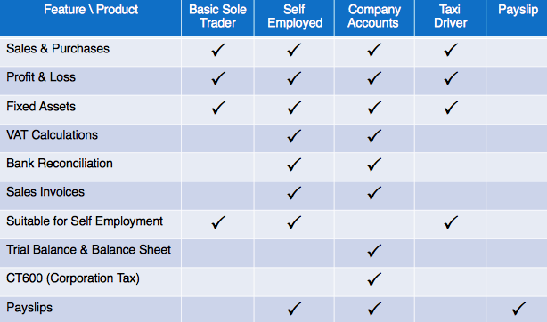

# name
ProductsPage

# title
Tax Accounting Software, Payroll Software, Company Formation Products

# description

DIY Accounting provides payslip software &amp; finance accounting software, &nbsp;company formation UK,
small business accounting software and tax accounting software that produces the self employed tax return,
paye tax returns plus limited liability company registration. Excel bookkeeping and accounting spreadsheets
providing accounts systems for the UK small business market that makes bookkeeping entries fast and easy
with different types of accounting software for sole trader accounts, self employed accounts and limited
company accounting.

# image

# metaDescription
Small business accounting software products, payroll software, self employed and company accounts, tax returns in easy to use Excel spreadsheets.

# keywords
accounting software, payroll software, accounting spreadsheets, small business software, tax software, accounting software package, small business accounting software, small business accounting, self employed tax return, bookkeeping, accounting software uk, payroll, company formation, company formation UK, tax, tax return, tax accounting, accounting, limited liability company
