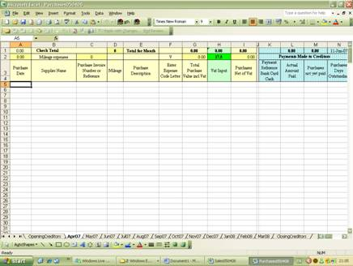

# name
SEPurchaseSpreadsheetFeature

# title
Self employed small business purchases accounting spreadsheets

# shortTitle
Purchase Spreadsheets

# description

        Annual&nbsp;PAYE&nbsp;return showing The purchases bookkeeping spreadsheet is used to record the self employed expenses. The format of the accounts spreadsheet has columns to enter the purchase date, supplier name, description of the expense and the total amount invoiced.&rsquo; names, income tax and national insurance calculated automatically.
    

# trailingBody

    <strong>Self employed Purchases Expense Analysis Accounting Spreadsheets</strong>

The purchases bookkeeping spreadsheet is used to record the self employed expenses. The format of the accounts spreadsheet has columns to enter the purchase date, supplier name, description of the expense and the total amount invoiced.

    For vat registered businesses the vat input on expenses is calculated and automatically entered in the vat column. If the vat rate changes simply change the vat percentage at the top of the vat column. For non vat registered business simply change the vat rate to zero and no vat calculation is performed.
     
     
     
    The clever part of the expense accounting spreadsheet is the expense analysis which uses a simple entry letter code from a drop down menu to analyse costs by expenditure type. That purchases expense analysis being in the same format as required for the self employed tax return.
     
     
     
    <strong>SCREENSHOT PURCHASES EXCEL BOOK KEEPING SPREADSHEET</strong>

    <strong>
         
    </strong>

Entries are only required in the above columns of this simple bookkeeping system which consists basically of making a list of purchases each month

The green shaded column for vat automatically calculates vat on purchase invoices at the current VAT rate (20% in 2013). If any purchases are at different vat rates, e.g. zero or 5% for power bills then simply overwrite the vat with the actual vat amount. Flexibility built in as by changing the standard rate (20% in 2013)&nbsp;to zero the vat is disabled enabling the Accounting Software to be suitable for both vat registered and non vat registered businesses.

The orange shaded columns of the sales excel spreadsheet are automated and triggered by simply entering the type of receipt used to pay you. Automated small business book keeping software.

    <strong>PURCHASE CREDITORS</strong>

An optional feature but nevertheless very important aspect of any business is maintaining strong financial control, a major element of that financial control ensuring all purchases are paid for to maintain good supplier relations which are useful to driving lowest prices and achieving highest discounts. The purchase spreadsheet contains the following table to enable that control to be precise and accurate

    <strong>Image needed here</strong>

Enter the method of payment and the amount paid. The formulae calculate any outstanding amounts yet to be paid and automatically calculate the number of days that purchase has been outstanding and being written on excel spreadsheets a simple click of the mouse offers a visual appreciation of just how much money has still to be paid Accountancy software working for you.

    <strong>PURCHASES EXCEL BOOK KEEPING SPREADSHEET Part 2 THE EXPENSE ANALYSIS</strong>

This area of the book keeping software if it can be called that is fully automated. No entries are required in this area of the purchases bookkeeping which is all completed and analysed by entering a single letter in the column shown in the above Part 1 headed "Enter Expense Code Letter" Which has a drop down menu to make life easier.. The book keeping software then uses the letter entered to determine which column to place the expenditure, totals that expenditure and also transfers that total to the profit and loss account.

    <strong>Image needed here</strong>

The expense headings used in the purchase excel spreadsheet have not been arbitrarily selected. This self employed small business book keeping software uses the same expense analysis headings as the inland revenue self assessment tax return. A solution for a simple book keeping system with notes in the book keeping system user guide as to what items should be analysed to which columns.

    <strong>What happens to the purchase expenses entered?</strong>

The above excel book keeping spreadsheet totals each column for each book keeping month. The totals of each sheet are then collected by the accountancy software to complete the simple book keeping system by automatically producing the vat returns each quarter, monthly profit and loss account and self assessment tax return to complete the self employed book keeping system. The purchase mileage, if recorded - it is optional - is also automatically adds in the sales mileage to the purchase mileage and calculates the mileage allowance. Mileage allowances are 45p for the first 10,000 miles and 25p thereafter and an alternative to claiming vehicle running costs including vehicle capital allowances on the fixed asset spreadsheet. This accountancy software will automatically claim 45p and change to 25p when applicable, users only have to enter the mileage covered.

The self employed user guide that accompanies this book keeping system has notes on mileage allowances and other tax tips to help save you money including household expenses that can be claimed and dealing with partner costs , tax saving tips that will be lost unless you follow the revenue ground rules carefully but will save self employed sole traders money .

Accountancy software designed to save many times the cost of buying it.

    <strong>FIXED ASSETS AND CAPITAL TAX ALLOWANCES</strong>

Fixed items are physical items used by the business over m a period of more than one year.

Depreciation spreads the financial effect on profits over the life of the fixed asset but does not have an effect on the business tax as depreciation is disallowed as an expense. Instead the business receives a capital tax allowance on the cost of fixed assets to set against its profit.

When the fixed asset spreadsheet is completed the capital allowances are automatically calculated and also update the profit and loss account in the depreciation column. While depreciation is then disallowed in the self assessment tax return the same amount is then added back to the expenses as capital allowances. Capital allowances on vehicles are automatically reduced by the personal use %.

For the financial year 6 April 2008 &ndash; 5 April 2009 100% of the cost of the asset can be set off against profits in the year purchased which is called Annual Investment Allowance replacing the previous First Year Allowance. The remaining value of assets is then written off against future years profits at 20% of the book value remaining. The accountancy software has these percentages already written into the book keeping system.

    <strong>Image needed here</strong>

Businesses should set a consistent policy in the treatment of fixed assets and it is suggested that only long term assets (used more than one year) and costing over &pound;100 should be classified as &ldquo;fixed&rdquo; 100 POUNDS IS A SUGGESTION NOT A SET RULE.EACH BUSINESS SHOULD SET ITS OWN FIXED ASSET POLICY

"Self employed bookkeeping software purchases expense analysis using simple excel accounting spreadsheets to record and analyse business purchases and expenses"

    <strong>
         
    </strong>

    <strong>
         
    </strong>

    <strong>
         
    </strong>

# metaDescription

        Annual&nbsp;PAYE&nbsp;return showing The purchases bookkeeping spreadsheet is used to record the self employed expenses. The format of the accounts spreadsheet has columns to enter the purchase date, supplier name, description of the expense and the total amount invoiced.&rsquo; names, income tax and national insurance calculated automatically.
    

# keywords

        Annual&nbsp;PAYE&nbsp;return showing The purchases bookkeeping spreadsheet is used to record the self employed expenses. The format of the accounts spreadsheet has columns to enter the purchase date, supplier name, description of the expense and the total amount invoiced.&rsquo; names, income tax and national insurance calculated automatically.
    

