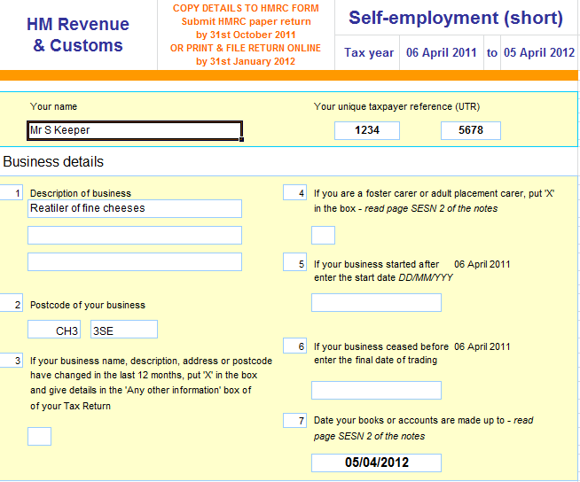
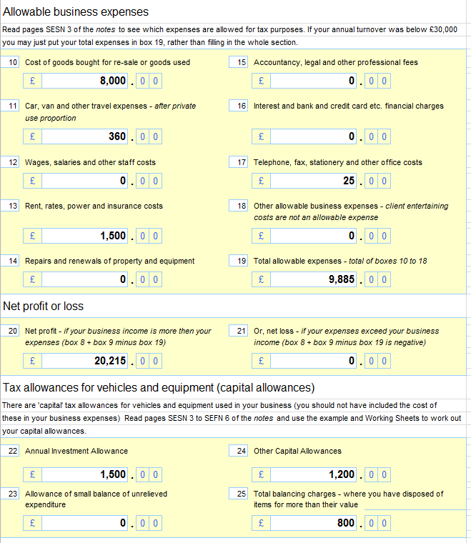

# name
SelfAssessmentFeature

# title
Self assessment tax return and the short Self employed tax return form

# shortTitle
Self Assessment

# description
A complete tax preparation software package that not only calculates the income tax liability but also completes an excel copy of the self employed tax return

# trailingBody

    <strong>Our packages</strong>

There are 3 DIY Accounting product lines that help small business to complete the business section of their Self Assessment tax return:

<ul>
    <li>
        <a href="product.html?product=BasicSoleTraderProduct">Basic Sole Trader</a> - Our simplest and cheapest product
    </li>
    <li>
        <a href="product.html?product=TaxiDriverProduct">Taxi Driver</a> - A small business package tailored specifically to taxi drivers
    </li>
    <li>
        <a href="product.html?product=SelfEmployedProduct">Self Employed</a> - A more advanced version with support for VAT, Employees and Bank Reconciliation
    </li>
</ul>

The links above take you through to page with more information and a facility to select the year you wish to prepare accounts for.

    <strong>Eligibility to Complete the Self Employed Tax Return</strong>
     
    If you have earnings from which an employer deducts income tax and national insurance then you are employed and the employer has to account for those deductions to HMRC under the PAYE system. Alternatively if you are in business for yourself and receive income without deduction of tax then you are probably self employed and need to account for the net taxable profit made and complete an annual self employed tax return. Formerly known as the self assessment tax return HMRC changed the format in April 2008 to the self employed tax return which is applicable retrospectively to the financial tax year 2007-08 onwards.
     
     
     
    Self employment has to be registered with HMRC within 3 months of starting the business to avoid a late registration fine.
     
     
    The new self employed tax return that sole traders must complete is better laid out than the old self assessment tax return and is in 2 formats, the short tax return and the full tax return that is similar but requires more details and is specifically targeted at business with a turnover over &pound;77,000 (for 2012-13).
     
     
     
    <strong>Sole trader accounts tax software automatically completes the self employed short tax return</strong>
     
     
     
     <strong>Filing the Paper Self Employed Tax Return and Filing the Tax Return Online</strong>
     
    HMRC will send the paper self employed tax return to your registered address each year which has to be submitted by 31st October following the end of the financial year.
     
    Tax returns can still be filed later by filing online by the following 31st January.
     
     
     
    If the intention is to file online the sole trader has to first register with the HMRC website and the password is sent by post usually within 7 to 10 days so registration should be completed well in advance.
     
    The main benefit of filing online is the immediate calculation of the income tax and national insurance liability. HMRC frequently experience computer problems on the last day of filing and it is better to file online at least 5 days before the deadline to avoid these problems and potential late filing penalties
     
     
     
    HMRC states that Self Assessment Online offers significant advantages over the traditional paper Self Assessment tax return.
     
    It is secure, accurate and automatically calculates your tax
     
    You get immediate acknowledgement and faster repayment if we owe you money
     
    You can view your liabilities and payments in an online Statement of Account
     
    You can choose to receive notices and reminders by secure email or text messages.
     
     
     
    <strong>Automated Sole Trader Tax Return</strong>
     
    No manual entries are required to complete the HMRC self employed tax return form which is completed automatically as part of the small business tax preparation software from the profit and loss account in the financial accounts file providing a complete tax software package with the tax calculation accounting spreadsheet.
     
     
     
    When the sole trader sales accounting spreadsheets and purchases accounting spreadsheets have been completed the HMRC self employment short tax return form is ready to be printed ready for you to go online and enter the accounts direct to the inland revenue website who will then automatically calculate the tax liabilities already advised on the draft tax calculation included in the sole trader accounts package.
     
     
     
    The sole trader accounting package completes a copy of the HMRC short tax return as the threshold limit for completing the full return in 2012-13 was &pound;77,000 which was also the vat threshold limit for that financial year. Therefore the self employed accounting package would be more suitable if the sales turnover was likely to be in this region as there would be the possibility for vat registration if the vat threshold limit was exceeded.
     
     
     
    <strong>Screenshots of HMRC self employed tax return form the sole trader accounting software completes automatically.</strong>

    

    A complete tax preparation software package that not only calculates the income tax liability but also completes an excel copy of the self employed tax return.

    

    <strong>Backing Up The Tax Accounting Records</strong>
     
    There is a legal obligation to keep accounting records for at least 5 years and 10 month after the end of the tax year and therefore it is advisable that when the sole trader accounts are completed a back up copy is saved. Computers crash and so it is recommended that the sole trader accounts are emailed to yourself when complete so a back up copy of the accounts is kept on the email server computer as additional insurance. The fine for not keeping records or maintaining a copy can be up to &pound;3,000.

    For more information on the self employed tax issues visit the DIY Accounting Tax Articles section
     
     
     
    <strong>Links direct from the HM Revenue &amp; Customs website on Self Assessment</strong>
     
    Self Assessment 
     
    Comprehensive information and assistance in all aspects of Self Assessment.
     
    Self Assessment Self Employed 
     
    Specific information about Self Assessment and how it might affect you when you start working for yourself.
     
    Self Assessment Online 
     
    Filing your Tax Return online offers you automatic calculation of tax, immediate acknowledgement of receipt and faster repayment if you are owed money. You can also view your Liabilities and Payments online.
     
    Self Assessment: Tax Return Forms, Notes and Help sheets

     
    You are now able to complete and send back your current year's Tax Return over the Internet.
     
    Brief descriptions of the full range of Accounting Software, Payroll Software, Company Formation are available on the DIY Accounting home page

"DIY Accounting sole trader accounts tax preparation software automatically completes a copy of HMRC short self employed tax return form"

    
         
    

# metaDescription
A complete tax preparation software package that not only calculates the income tax liability but also completes an excel copy of the self employed tax return

# keywords
A complete tax preparation software package that not only calculates the income tax liability but also completes an excel copy of the self employed tax return
