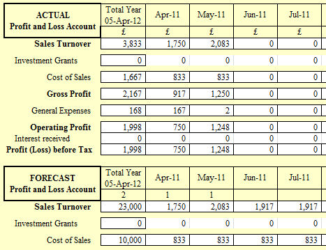

# name
SelfEmployedProduct

# title
Self employed tax form accounting and self assessment tax return

# shortTitle
Self Employed

# from
25

# description

        DIY Accounting Spreadsheets is the ultimate, easy-to-usesimple self employed accounting software for anyone self employed who are vat registered, not vat registered and with or without employees, &nbsp;enabling &nbsp;accounts work to be completed in hours not days producing the <a href="feature.html?feature=SETaxReturnFeature">self employed tax form</a>, self assessment tax return and vat returns revenue tax forms on accounting spreadsheets.
    

    

        This accounts software package is a single-user program designed to suit self employed businesses who are vat registered, and lets small and medium business manage their financial accounts, customers and suppliers without previous accounts software experience. All the accounting entries to be made are 2 lists of <a href="feature.html?feature=SESalesSpreadsheetFeature">sales receipts</a> and <a href="feature.html?feature=SEPurchaseSpreadsheetFeature">purchase expenses</a>. Designed to be a simple accounting software package specifically as accounting software to account for self employed pay who need to produce vat returns and is also suitable for anyone self employed who are not vat registered.
    

# image

# trailingBody

    From April 2019 the next phase of the HMRC <strong>Making Tax Digital</strong> comes into force. We are&nbsp;pleased to announce a collaboration with VitalTax to ensure our customers will be able to comply.&nbsp;Checkout our <a href="feature.html?feature=VatReturnsFeature">VAT page</a> for more information.

Enter purchase invoices from suppliers, the money control feature shows who has been paid and is outstanding.

Enter sales invoices to customers and the money control feature shows who has paid and who still owes you money.

Single letter entry on the purchases spreadsheet provides the accounting expenditure analysis and updates your financial accounts.

    This package includes our <a href="feature.html?feature=SalesInvoiceFeature">Sales Invoice generator</a>.

Enter vehicles and assets purchased and the Fixed Asset schedule calculates the capital allowances and puts these in your self assessment tax return for you

Quarterly Vat returns produced with details how to protect your sheets providing a vat audit trail

DIY Accounting Payroll Software easily integrated to provide the Complete Accounting Software solution

Optional Cash and Bank spreadsheets for those businesses who operate business bank accounts

Stock Control feature to identify and control potential losses

Annual and Monthly Profit and Loss Statement produced.

Fully automated Profit Forecast that calculates annual tax and national insurance liabilities to provide a unique Financial Business Health Check

Accounting software that produces both the full and short Self Employed tax return all fully automated with no entries required to generate the revenue tax forms

DIY Accounting software that estimates your Income Tax and self employed National Insurance liability

Self Employed Accounts simple business accounting software UK User Guide accompanies the package containing concise, easy to read notes plus all important tips on HMRC guidelines to save you taxes.

Technical and Operational support for DIY Accounting Software direct from the designer is included by phone or online via email with over 95% of questions dealt with the same day.

# metaDescription
DIY Accounting software produces the self employed tax form, self assessment tax return and vat returns revenue tax forms on accounting spreadsheets

# keywords
accounting software, payslip software, accounting spreadsheets, small business software, tax software, accounting software package, small business accounting software, small business accounting, self employed tax return, bookkeeping, accounting software uk, payslip, company formation, company formation UK, tax, tax return, tax accounting, accounting, limited liability company

# featureNames
- SESalesSpreadsheetFeature
- SalesInvoiceFeature
- SEPurchaseSpreadsheetFeature
- SECashandBankFeature
- SEVATReturnFeature
- SEProfitandLossFeature
- SelfAssessmentFeature
- PayslipsFeature
- SETaxReturnFeature

# featured
false

# precedence
040
