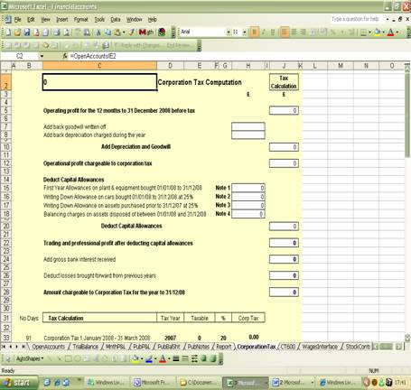
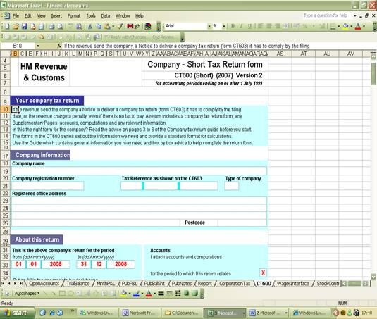

# name
TaxandAssetsFeature

# title
Limited Company corporation tax software fills in CT600 return

# shortTitle
Tax and Assets

# description

To complete the small business tax software automated within the DIY Accounting limited company accounts software calculates the Corporation Tax liability which is the responsibility of every limited company.

# trailingBody

    <strong>Limited Company corporation tax software fills in CT600 tax return</strong>

To complete the small business tax software automated within the DIY Accounting limited company accounts software calculates the Corporation Tax liability which is the responsibility of every limited company.

No entries required. Fully automated to produce the corporation tax liability in real time. This excel spreadsheet is available anytime during the financial year so users can view their potential income tax liability which DIY Accounting regard as an essential element of any limited company tax software. Corporation Tax payable is one of the most significant costs of any limited liability company. No accounts software UK, no small business tax software can be complete without calculating the corporation tax so directors of a Limited Liability Company know where they stand financially in real time.

Up to date with the current corporation tax rates and tax allowances the small business tax software takes the net profit direct from the profit and loss account and calculates the tax payable, produced individually for each financial year end.

    <strong>Corporation Tax calculation spreadsheet automatically completed with no manual entries required.</strong> Dates and tax rates have all been entered in the structure of the package according to the company financial year end and the tax rates applicable to that financial year.

    <strong>
         
    </strong>

    The corporation tax calculation is supported by comprehensive details of the first year allowances, writing down allowances and balancing charges. <strong>All allowances calculated automatically and automatically entered in this supporting schedule to the corporation tax calculation.</strong>

    <strong>
         
    </strong>

Submitting the accounts to HM revenue &amp; customs requires a copy of the annual financial accounts which the package produces automatically from the basic data entry, plus the corporation tax calculation as above which is automated and finally must also include the CT600 Company Short Tax return form.

    <strong>CT600 Corporation Tax Return</strong>

The limited company accounts package produces an excel copy of the CT600 short tax return. All entries being automated collected from the tax calculation and general company details. The format of this excel copy has been designed to look and feel exactly the same as the official HM Revenue &amp; Customs form to enable it to be printed and the numbers all being calculated accurately in the correct boxes to enable them to be copied straight into the official CT600 short tax return.

    <strong>TAX DOESN'T HAVE TO BE TAXING WHEN IT IS ALL AUTOMATED BY THE</strong>

    <strong>DIY ACCOUNTING SMALL BUSINESS TAX SOFTWARE</strong>

    <strong>Image needed here</strong>

Small limited companies can and almost invariably do claim audit exemption but still require several hours study to produce the tax calculation and in particular the CT600 short tax return. The alternative is to pay your accountant a substantial accounting fee to prepare the tax return.

    <strong>The Limited Company Accounts package does it for you AUTOMATICALLY</strong>

"Limited company tax preparation software calculates corporation tax liability and fills in CT600 tax return"

    <strong>
         
    </strong>

    <strong>
         
    </strong>

# metaDescription

To complete the small business tax software automated within the DIY Accounting limited company accounts software calculates the Corporation Tax liability which is the responsibility of every limited company.

# keywords

To complete the small business tax software automated within the DIY Accounting limited company accounts software calculates the Corporation Tax liability which is the responsibility of every limited company.

