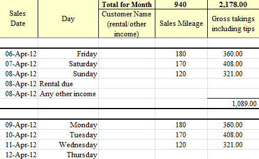

# name
TaxiDriverProduct

# title
Cabsmart Private Hire & Mini Cab Taxi Driver Accounts Software

# shortTitle
Taxi Driver

# from
20

# description
DIY Accounting Cabsmart taxi driver accounts is the practical easy-to-use bookkeeping software solution to taxi drivers accounts, designed on excel spreadsheets specifically for self-employed private hire, mini cab, taxi drivers, van driver and couriers, enabling you to reduce your taxi accounting work to hours instead of days.

# image

# trailingBody

    <strong>Cabsmart Taxi Driver Accounts software automates the self employed tax return for taxi &amp; van drivers working as your taxi accountant</strong>

DIY Accounting Cabsmart taxi driver accounts is the practical easy-to-use bookkeeping software solution to taxi drivers accounts, designed on excel spreadsheets specifically for self-employed private hire, mini cab, taxi drivers, van driver and couriers, enabling you to reduce your taxi accounting work to hours instead of days.

    <strong>Key Features &amp; Benefits of DIY Accounting Taxi driver accounts software UK</strong>

Enter purchase invoices from suppliers, the simple automated money control feature shows who has been paid and is outstanding. Also enter mileage covered as an optional extra

Enter sales receipts to customers and the simple automated money control feature shows who has paid and who still owes you money. Also enter mileage covered as an optional extra

Single letter entry on the purchases spreadsheet provides the accounting expenditure analysis and updates your financial accounts.

Enter vehicles and assets purchased and the Fixed Asset schedule automatically calculates the capital allowances and puts these in your self employed tax return for you. While private taxi vehicles are treated as private vehicles for capital allowances while the black cab, Hackney cab are classed as commercial vehicles.

Taxi driver accounts automatically compares and chooses the most tax efficient method of claiming vehicle expenses, mileage allowances or vehicle capital allowances and running costs, choosing vehicle running costs if mileage is not entered or is a lower cost than vehicle running expenses.

Annual and Monthly Profit and Loss Accounts produced automatically

Automated Wage Forecast that works out the annual income tax and national insurance liability for taxi drivers and assists financial control through adding your drawings to provide an ongoing Financial Health check.

    Taxi accounting software that produces a copy of your <a href="feature.html?feature=TaxiSATaxFeature">Self employed tax return</a> on excel fully automated, no entries required

DIY Accounting software that automatically estimates your Income Tax and self employed National Insurance liability

The DIY Accounting Cabsmart small business accounting software User Guide accompanies the package containing concise, easy to read notes plus all important tips on HM Revenue &amp; Customs guidelines to save you taxes.

Technical and Operational support is included by phone or online via email with over 95% of questions dealt with the same day.

    If you wish to ask a question please post your question in the DIY Accounting Teneric forum at
     
    <a href="http://forums.teneric.co.uk/diy-accounting/">http://forums.teneric.co.uk/diy-accounting/</a>

# metaDescription
Private hire, taxi and mini cab driver bookkeeping accounts produce the short tax return working a drivers taxi accountant accounting software

# keywords
accounting software, payroll software, accounting spreadsheets, small business software, tax software, accounting software package, small business accounting software, small business accounting, self employed tax return, bookkeeping, accounting software uk, payroll, company formation, company formation UK, tax, tax return, tax accounting, accounting, limited liability company

# featureNames
- TaxiVATFeature
- TaxiProfitandLossFeature
- TaxiSATaxFeature
- TaxiIncomeTaxFeature
- TaxiReceiptsFeature
- TaxiExpensesFeature

# featured
true

# precedence
030
